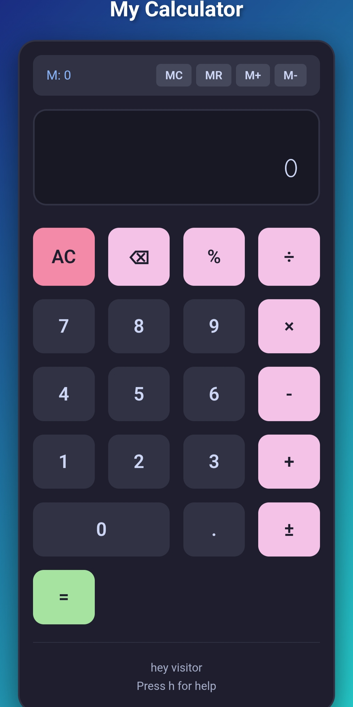

#  My First React Project

This is my first React project that I built and pushed using **Termux** on my mobile phone!

## Project Screenshot

## Tech Stack
- **React** - Frontend library
- **Vite** - Build tool
- **JavaScript (JSX)** - Programming language
- **Termux** - Mobile terminal/development environment

##  Development Setup on Mobile
1. Installed Termux from F-Droid
2. Set up Node.js and Git in Termux
3. Created React project using Vite
4. Coded everything in mobile terminal/text editor
5. Pushed to GitHub using GitHub CLI (gh)

## Why Mobile Development?
Idk XD
